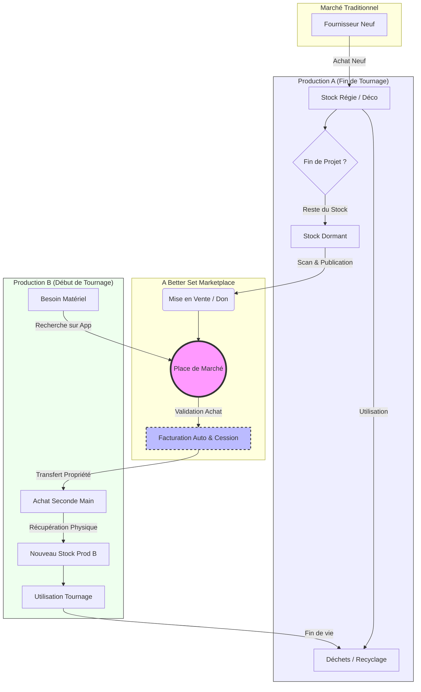

# DOSSIER DE PRÉSENTATION - A BETTER SET

Ce dossier détaille les fonctionnalités de l'application **A Better Set** et le flux de gestion des consommables, destiné à l'échange avec l'IA Gemini.

## 1. Vue d'ensemble
**A Better Set** est une solution SaaS de gestion de production audiovisuelle (Cinéma, Séries, Pub) axée sur l'efficacité opérationnelle et l'économie circulaire. Elle permet de gérer le quotidien d'un tournage tout en facilitant la revente et le réemploi du matériel entre productions.

## 2. Fonctionnalités Détaillées

### A. Gestion Quotidienne (Le "Set")
Ces outils facilitent la vie des équipes (Régie, Production, HMC, etc.) au jour le jour.

*   **Tableau de Bord (Dashboard)** : Vue synthétique des alertes, tâches et métriques clés du projet en cours.
*   **Feuilles de Service (Callsheets)** : Distribution numérique des feuilles de service quotidiennes.
*   **Feuilles d'heures (Timesheets)** : Saisie et validation des heures de travail des techniciens (calcul automatique des heures supp, majorations de nuit, etc.).
*   **Gestion des Renforts** : Planification et suivi des techniciens en renfort (embauches courtes).
*   **Logistique (Aller-Retour Matériel)** : Suivi des mouvements de matériel (caméras, lumières, véhicules) entre les loueurs et le plateau.
*   **Feuille Cantine (Catering)** : Gestion des effectifs pour les repas (interfacé avec la feuille de service et les renforts).
*   **Bible Équipe (Team Directory)** : Annuaire centralisé et sécurisé de tous les membres de l'équipe.
*   **Mur Social** : Réseau social interne à la production (et inter-prod) pour la communication d'équipe, partage de photos, etc.

### B. Gestion des Stocks & Coûts
*   **Consommables (Inventory)** : Gestion des stocks de fournitures (bureau, régie, déco). Suivi des entrées/sorties.
*   **Notes de Frais** : Saisie, scan (OCR) et validation des dépenses des équipes avec catégorisation automatique.

### C. Économie Circulaire & Marketplace (Le "Better")
Le cœur de l'innovation : transformer les déchets en ressources.

*   **Marketplace Inter-Productions** :
    *   **Vente** : Une production peut mettre en vente ses surplus (stock dormant) à la fin d'un tournage.
    *   **Achat** : Une nouvelle production peut acheter ces stocks à prix réduit (géolocalisés).
    *   **Facturation** : Génération automatique des factures de cession entre les sociétés de production.
*   **Dons & Réemploi** : Possibilité de donner le matériel invendu à des associations ou écoles.
*   **Rapport RSE (Impact Report)** : Calcul automatique de l'empreinte carbone évitée grâce au réemploi et suivi des indicateurs écologiques (Ecoprod).

### D. Administration
*   **Gestion des Droits** : Rôles utilisateurs (Admin, Production, Chef de poste, Technicien).
*   **SaaS & Facturation** : Gestion des abonnements à la plateforme.

---

## 3. Schéma des Mouvements des Consommables

Ce diagramme illustre le cycle de vie d'un consommable (ex: Ramette de papier, Gaffer, Gobelets) au sein de l'écosystème **A Better Set**.

### Explication du Flux
1.  **Acquisition** : Le matériel entre dans le stock de la **Prod A**, soit via un achat neuf, soit via la Marketplace.
2.  **Vie du Projet** : Le stock vit (entrées/sorties) durant le tournage.
3.  **Valorisation** : À la fin, au lieu de jeter ou de stocker indéfiniment ("Stock Dormant"), la Prod A met en vente le surplus sur la **Marketplace**.
4.  **Transaction** : La **Prod B** achète ce surplus. La plateforme gère la transaction financière et légale (Cession).
5.  **Réemploi** : Le matériel connaît une seconde vie sur le tournage de la Prod B, évitant un nouvel achat neuf et réduisant l'impact carbone.
